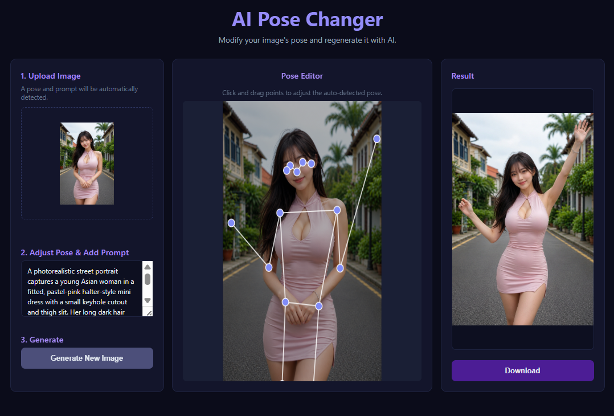

# AI Pose Changer

인물 이미지를 업로드하고 스켈레톤 관절을 드래그해서 자세를 수정하면, AI가 새로운 포즈의 이미지를 생성해 주는 웹 애플리케이션입니다.  
Cluade code 에 의해서 생성되었습니다. 

## 주요 기능

- **자동 포즈 감지** — 업로드한 이미지에서 17개 관절 좌표를 자동으로 추출
- **인터랙티브 스켈레톤 편집기** — 캔버스 위에서 관절 포인트를 드래그해 원하는 자세로 조정
- **자동 프롬프트 추출** — Gemini AI가 업로드 이미지를 분석해 이미지 생성 프롬프트를 자동 제안
- **AI 이미지 생성** — 원본 이미지 + 수정된 스켈레톤 + 텍스트 프롬프트를 Gemini에 전달해 새로운 포즈의 이미지 생성
- **결과 다운로드** — 생성된 이미지를 바로 저장

## 결과 예시



## 기술 스택

| 영역 | 기술 |
|------|------|
| Frontend | HTML / CSS / Vanilla JS |
| Backend | Python FastAPI |
| 포즈 감지 | MediaPipe Pose Landmarker |
| AI (프롬프트 추출 + 이미지 생성) | Google Gemini API (`gemini-3.1-flash-image-preview`) |

---

## 설치 방법

### 사전 요구사항

- Python 3.10 이상
- Google Gemini API 키 ([Google AI Studio](https://aistudio.google.com/)에서 발급)

### 1. 저장소 클론

```bash
git clone https://github.com/wonwizard/AIPoseChanger.git
cd ai-pose-changer
```

### 2. 패키지 설치

```bash
cd backend
pip install -r requirements.txt
```

### 3. 환경 변수 설정

프로젝트 루트에 `.env` 파일을 생성하고 API 키를 입력합니다.

```bash
cp .env.example .env
```

`.env` 파일을 열어 아래와 같이 수정합니다.

```
GOOGLE_API_KEY=여기에_발급받은_API_키_입력
```

---

## 실행 방법

```bash
cd backend
uvicorn main:app --reload
```

서버가 시작되면 브라우저에서 아래 주소로 접속합니다.

```
http://localhost:8000
```

### 사용 순서

1. **Upload Image** — 인물 사진을 드래그 앤 드롭하거나 클릭해서 업로드
2. **Pose Editor** — 자동 감지된 스켈레톤의 관절 포인트를 드래그해서 원하는 자세로 수정
3. **Prompt** — 자동 생성된 프롬프트를 그대로 사용하거나 직접 편집
4. **Generate New Image** — 버튼 클릭 → Result 창에서 결과 확인 및 다운로드

> **첫 실행 시** MediaPipe 포즈 감지 모델 파일(~25 MB)이 자동으로 다운로드됩니다.
